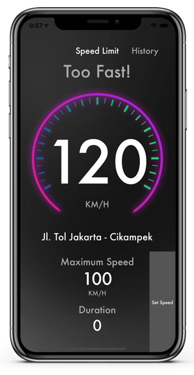

# SpeedLimit


[](https://developer.apple.com/iphone/index.action)
[](https://developer.apple.com/swift)


An application for safing your life while you were driving!
## Getting Started

``` bash
git clone https://github.com/rifqialfaizi/SpeedLimit.git
cd SpeedLimit
open SpeedLimit.workspace # or xed .

- Run (⌘ + R) or
- Test (⌘ + U)
```

## Speed Limit Design
  <p float="left">
    
     
     
     
  </p>

Feature: 
- Speedometer 
- Reminder when its too fast
- Set maximum speed
- Screen turn red when its too fast
- Location
- History


## Why I am building this?
1. Explore CLLocatio
2. Learn new thing


## Preview

